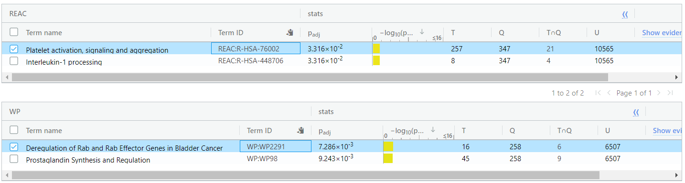

## Abstraction
  This dataset is the gene expression profiling of MDA231, BT549 and SUM159PT celles after selumetinib treatment or DUSP4 siRNA knockdown. MDA231, BT549 and SUM159PT basal-like breast cancer cell lines were transfected with non-targeting siRNA (siCONTROL), siRNA targeting DUSP4 (siDUSP4), or siCONTROL + 4 or 24 hr of 1uM selumetinib. The data were log2 RMA normalized.   
    
  This dataset has 36 samples which can be separated to 3 groups by different cell lines (MDA231, SUM159PT, BT549). Each cell line has 12 samples which can be separated to 2 groups by different drug treatments (DMSO, Selumetinib). Each drug treatment has 3 controls and 3 cases.  
  
## Introduction
  Basal-like breast cancer (BLBC) is an disease that has less clinically approved targeted therapy. This research focus on the dual specificity phosphatase-4 (DUSP4) is a negative regulator of the activation of the mitogenactivated protein kinase (MAPK) pathway that is deficient in BLBCs treated with chemotherapy. This paper investigated how DUSP4 regulates the MAP-ERK kinase (MEK) and c-jun-NH2-kinase (JNK) pathways in modifying cancer stem cell like behavior. This research support the MEK and JNK pathways inhibitors are therapeutic agents in basal-like breast cancer to eliminate the cancer stem cell population.  
  The paper introduces several methods to collect the resources and manipulate the data. They used microarrays as a tool that cells were harvested 96 hours after setting up all the control and case samples. For the statistical analysis, linear regression, ANOVA and the Student t tests are used which can be found from the original paper. Student t test was used for two groups analysis, multiple group analysis was conducted by ANOVA with Tukeypost hoc analyses.  
    
  The dataset has total 36 sample with 3 different cell lines, MDA231, BT549 and SUM159PT. Each cell line has 2 different drug treatments which are siDUSP4 and selumetinib and contains 12 samples. Every 6 samples are in a group with 3 CONTROLS and 3 CASES. In the following statistics, dataset has two characteristics, one is separated by CONTROL and CASE, the other is separated by different cell lines. The linear regression model design was based on these two characteristics. 
  

```{r load_package, include=FALSE}
library(GEOquery)
library(Biobase)
library(limma)
library(edgeR)
```

```{r download_data, include=FALSE}
#load data
# load origin data without mapping and clean duplicates
gset <- getGEO("GSE41816", GSEMatrix =TRUE, getGPL=FALSE)
if (length(gset) > 1) idx <- grep("GPL11532", attr(gset, "names")) else idx <- 1
gset <- gset[[idx]]
save(gset, file = 'GSE41816_matrix.Rdata')

gse <- getGEO('GSE41816', destdir = ".",
               AnnotGPL = FALSE,
               getGPL = FALSE)

exp <- read.table(file = 'GSE41816_series_matrix.txt.gz',
                      sep = '\t',
                      header = TRUE,
                      quote = '',
                      fill = TRUE,
                      comment.char = "!")
exp0 <- exp
# save
save(exp0, file = 'exp_GSE41816.Rdata')
```

```{r format_data, include=FALSE}
#GSE41816
# load the data
load("exp_GSE41816.Rdata")
# change the row names into probe_id
rownames(exp0) <- exp0[, 1]

# loading the database contain the HUGO symbols
library(hugene11sttranscriptcluster.db)
# load probe_ids and symbols
ids <- toTable(hugene11sttranscriptclusterSYMBOL)
# number of unique symbols
#length(unique(ids$symbol))

# load probe_ids and ensembl ids
ensembl <- toTable(hugene11sttranscriptclusterENSEMBL)
# number of unique ensembl ids
#length(unique(ensembl$ensembl_id))

#table(rownames(exp0) %in% ids$probe_id)
# save exists probe_ids in table according to HUGO database
# only mapped genes can be saved
exp0 <- exp0[rownames(exp0) %in% ids$probe_id,]

# reduce the duplicated symbols, choose the max value in the row
tmp <- by(exp0,
         ids$symbol,
         function(x) rownames(x)[which.max(rowMeans(x))])

probes <- as.character(tmp)
# filter again, leave unique symbols in the table
exp0 <- exp0[rownames(exp0) %in% probes,]

ids <- ids[match(rownames(exp0), ids$probe_id),]
ensembl <- ensembl[match(rownames(exp0), ensembl$probe_id),]
# change the row names into symbols
rownames(exp0) <- ids$symbol
# add new column to save ensembl ids
exp0$X.Ensembl_ID <- ensembl$ensembl_id
exp1 <- exp0
# save into my local folder
# exp1 contains the final result after mapping and clean
exp1 <- na.omit(exp1)
save(exp1, file = 'exp_GSE41816_id_trans.Rdata')
```

## Visualization

```{r plot1, echo=FALSE}
# load data after mapping and clean
load("exp_GSE41816_id_trans.Rdata")
# load data as matrix
load("GSE41816_matrix.Rdata")
```

```{r plot2, echo=FALSE}
#=================================================
# Plots
# boxplot for original data from GEO database
par(mar=c(2+round(max(nchar(sampleNames(gset)))/2),4,2,1))
title <- paste ("GSE41816", '/', annotation(gset), "Original Selected Samples", sep ='')
boxplot(exprs(gset), boxwex=0.7, notch=T, main=title, outline=FALSE, las=2)
```
  This is the Boxplot of the original data.

```{r plot3, echo=FALSE}
#==============================================
# boxplot after normalized
# log ratio for the genes after mapping and clean
d2p <- log2(cpm(exp1[, 2:37]))
boxplot(d2p, xlab = "Samples", tlab = "log2",
        las = 2, cex = 0.5, cex.lab = 0.5,
        cex.aixs = 0.5, main = "CPM Normalized Samples")
abline(h = median(apply(d2p, 2, median)), 
       col = "green", lwd = 0.6, lty = "dashed")
```
  The boxplot shows the data after normalization, log2 ratio and cpm were used.

```{r plot4, echo=FALSE}
#=============================================
# Separate into groups
group_list <- c(rep('MDA231_siCONTROL', 3), rep('MDA231_siDUSP4', 3),
                rep('MDA231_AZD6244 4h', 3), rep('MDA231_AZD6244 24h', 3),
                rep('SUM159PT_siCONTROL', 3), rep('SUM159PT_siDUSP4', 3),
                rep('SUM159PT_AZD6244 4h', 3), rep('SUM159PT_AZD6244 24h', 3),
                rep('BT549_siCONTROL', 3), rep('BT549_siDUSP4', 3),
                rep('BT549_AZD6244 4h', 3), rep('BT549_AZD6244 24h', 3))
# remove gene symbol and ensembl id
exp2 <- exp1[2:37]
colnames(exp2) <- rep(group_list, ncol(exp2)/36)
# exp2 defined groups

# boxplot by defined groups
boxplot(exp2, xlab = "Samples", tlab = "Values",
        las = 2, cex = 0.5, cex.lab = 0.5,
        cex.aixs = 0.5, main = "GSE41816 Selected Samples",
        col = c(rep("skyblue1", 3), rep("slateblue1", 3)))
```
  Boxplot from original data, blue color represents the CONTROL samples, and the purple color represents the CASE. 

```{r plot5, echo=FALSE}
#=========================================
# using normalize.quantiles to have a plot
library(preprocessCore)
GSE41816 <- normalize.quantiles(exprs(gset))
plot(density(GSE41816), col = "blue", main = "Quantile Normalization of GSE41816")
```
  Plot of GSE41816 database by using quantile normalization.

```{r plot6, echo=FALSE}
#=======================================
GSE41816log <- log2(exprs(gset))
plot(GSE41816log, main = "QQplot of GSE41816")
```
  QQ-Plot of GSE41816 database.

```{r plot7, echo=FALSE}
#=======================================
# Density plot with log2()
count_density <- apply(log2(exp1[, 2:37]), 2, density)

xlim <- 0; ylim <- 0
for(i in 1:length(count_density)) {
  xlim <- range(c(xlim, count_density[[i]]$x));
  ylim <- range(c(ylim, count_density[[i]]$y));
}

cols <- rainbow(length(count_density))
ltys <- rep(1, length(count_density))

plot(count_density[[1]], xlim = xlim, ylim = ylim,
     type = "n", ylab = "Smoothing density of log2 - siRNA",
     main = "", cex.lab = 0.85)

for (i in 1:length(count_density)) {
  lines(count_density[[i]], col = cols[i], lty = ltys[i])
}

legend("topleft", colnames(exp2), col = cols, 
       lty=ltys, cex = 0.40, border = "blue", 
       text.col="green4", merge = TRUE, bg = "gray90")
```
  This is the density plot by using log2 ratio for the original data.

```{r plot8, echo=FALSE}
#=======================================

filter_matrix <- as.matrix(exp1[, 2:37])
rownames(filter_matrix) <- exp1[,38]
d = DGEList(counts = filter_matrix, group = colnames(exp2))
# get normalized data by cpm()
nor_counts <- cpm(d)

#========================================
# density plot after normalized by cpm
cd1 <- apply(nor_counts, 2, density)

xlim1 <- 0; ylim1 <- 0
for(i in 1:length(cd1)) {
  xlim1 <- range(c(xlim1, cd1[[i]]$x));
  ylim1 <- range(c(ylim1, cd1[[i]]$y));
}

cols1 <- rainbow(length(cd1))
ltys1 <- rep(1, length(cd1))

plot(cd1[[1]], xlim = xlim1, ylim = ylim1,
     type = "n", ylab = "Normalized density of cpm - siRNA",
     main = "", cex.lab = 0.85)

for (i in 1:length(cd1)) {
  lines(cd1[[i]], col = cols1[i], lty = ltys1[i])
}

legend("topleft", colnames(exp2), col = cols, 
       lty=ltys, cex = 0.40, border = "blue", 
       text.col="green4", merge = TRUE, bg = "gray90")
```
  This the density plot after using cpm function.

```{r plot9, echo=FALSE}
#===============================================
# MDS plot
plotMDS(d, labels = colnames(exp2), col = c(rep("green", 3), rep("blue", 3)))
```
  MDS plot shows the relation between CONTROL and CASE. The relation between CONTROL and CASE are pretty close. The most differences are between differet cell types.

```{r group_data, echo=FALSE}
#get rid of low counts
cpms <- edgeR::cpm(exp1[, 2:37])
rownames(cpms) <- rownames(exp1)
keep <- rowSums(cpms > 1) >= 3
exp1_filter <- exp1[keep, ]
filter_data_matrix <- as.matrix(exp1_filter[, 2:37])

rownames(filter_data_matrix) <- exp1_filter$X.Ensembl_ID
  
#============================
# separate into control and case groups
exp_samples <- data.frame(
  lapply(colnames(exp1_filter)[2:37],
         FUN=function(x){
           unlist(x)[c(2,3)]
         }))
colnames(exp_samples) <- colnames(exp1_filter)[2:37]
rownames(exp_samples) <- c("sample", "cell_type")
exp_samples <- data.frame(t(exp_samples))
exp_samples$sample <- c(rep("CONTROL", 3), rep("CASE", 3))
exp_samples$cell_type <- rep(c("MDA231", "SUM159PT", "BT549"), each = 12)
#===========================
```


```{r calculation, echo=FALSE}
d <- DGEList(counts = filter_data_matrix, group = exp_samples$sample)

#create the model
model_pat <- model.matrix(~exp_samples$cell_type + exp_samples$sample)

# estimate dispersion
d <- estimateDisp(d, model_pat)

# calculate normalization factor
d <- calcNormFactors(d)
# fit model quasi
fit <- glmQLFit(d, model_pat)
# calculate differential expression
qlf.con_vs_case <- glmQLFTest(fit, coef = 'exp_samples$cell_typeMDA231')
#get all results
qlf_output <- topTags(qlf.con_vs_case, sort.by = "PValue", n = nrow(filter_data_matrix))

# how many genes pass the threshold p-value < 0.05
length(which(qlf_output$table$PValue < 0.05))
# how many genes pass correction
length(which(qlf_output$table$FDR < 0.05))
# how many genes are up regulated
length(which(qlf_output$table$PValue < 0.05
             & qlf_output$table$logFC > 0))
# how many genes are down regulated
length(which(qlf_output$table$PValue < 0.05
             & qlf_output$table$logFC < 0))
```
  The glmQLFTest from edgeR package is based on the cell line MDA231. There are 947 genes pass the threshold p-value which less than 0.05. There are 292 genes pass correction, 613 genes are up regulated and 334 genes are down regulated.


```{r table1, echo=FALSE}
head(qlf_output$table)
top <- rownames(head(qlf_output$table))
filter_data_matrix[top, ]
```
  This is part of the table contents after quasi linear fit and calculating the p-values. These two tables return the top hits which ranked by p-values and the corresponding original data.


```{r plot10, echo=FALSE}
# get differential expression genes
dt <- decideTestsDGE(qlf.con_vs_case)
isDE <- as.logical(dt)
DEnames <- rownames(d)[isDE]
head(DEnames)

plotSmear(qlf.con_vs_case, de.tags = DEnames, main = "Differential Expression Genes")
abline(h = c(-1, 1), col = "green")
plotMD(qlf.con_vs_case, status = dt, values = c(1, -1), 
       col = c("red", "blue"), main = "1.Up-regulated vs. -1.Down-regulated")
```
  Extract differential expressed genes, there is a part of genes names showing above. These two plots are used to visualize the amount of differentially expressed genes.

```{r plot11, echo=FALSE}
library(pheatmap)
ch <- qlf_output$table[qlf_output$table$PValue < 0.05,]
ch <- rownames(ch)
choose_matrix <- filter_data_matrix[ch, ]
colnames(choose_matrix) <- colnames(exp2)
choose_matrix <- t(scale(t(choose_matrix)))
pheatmap::pheatmap(choose_matrix,
                   border_color = NA,
                   show_rownames = FALSE,
                   drop_levels = TRUE)
```
  The heatmap contains the top hits which p-value less than 0.05 differential expression genes that calculated by quasi-likelihood.

```{r lmFite, echo=FALSE}
fit_lm <- lmFit(filter_data_matrix, model_pat)
fit_lm <- eBayes(fit_lm, trend = TRUE)
topfit_pat <- topTable(fit_lm,
                       coef = ncol(model_pat),
                       adjust.method = "BH",
                       number = nrow(filter_data_matrix))
output_hits_pat <- topfit_pat[order(topfit_pat$P.Value),]
head(output_hits_pat)

# how many gene pass the threshold p-vaule < 0.05
length(which(output_hits_pat$P.Value < 0.05))

# how many genes pass correction
length(which(output_hits_pat$adj.P.Val < 0.05))
```
  The table is the sample output for lmFit linear regression. There are 2670 genes pass the threshold which less than 0.05. 480 genes pass the correction.

```{r heatmap_lm, echo=FALSE}
library(pheatmap)
lmch <- output_hits_pat[output_hits_pat$P.Value < 0.05,]
lmch_matrix <- filter_data_matrix[lmch$ID, ]
colnames(lmch_matrix) <- colnames(exp2)
lmch_matrix <- t(scale(t(lmch_matrix)))
pheatmap::pheatmap(lmch_matrix,
                   border_color = NA,
                   show_rownames = FALSE,
                   drop_levels = TRUE)
```
  The heatmap contains the top hits which p-value less than 0.05 differential expression genes that calculated by lmFit.

```{r limma_quasi, echo=FALSE}
qlf_pval <- data.frame(
  ensembl_id = rownames(qlf_output$table),
  qlf_pvalue = qlf_output$table$PValue
)
limma_pval <- data.frame(
  ensembl_id = output_hits_pat$ID,
  limma_pvalue = output_hits_pat$P.Value
)

two_model_pval <- merge(qlf_pval,
                        limma_pval,
                        by.x = 1, by.y = 1)

two_model_pval$colour <- "black"
two_model_pval$colour[two_model_pval$qlf_pvalue < 0.05] <- "orange"
two_model_pval$colour[two_model_pval$limma_pvalue < 0.05] <- "blue"
two_model_pval$colour[two_model_pval$qlf_pvalue < 0.05 & two_model_pval$limma_pvalue < 0.05] <- "red"

plot(two_model_pval$qlf_pvalue,
     two_model_pval$limma_pvalue,
     col = two_model_pval$colour,
     xlab = "QLF model p-values",
     ylab = "Limma model p-values",
     main = "QLF vs Limma")
```
  This plot is used to compare Quasi-likelihood model and limma model.


The result p-values of ANOVA and a two-tailed Student t test are provided from the aboving picture. The p-value from picture B is the result of ANOVA. The p-value from picture E is the result of a two-tailed Student t test.


Microarray analysis was conducted on RNA derived from MDA231, BT549 and SUM159PT cells with treatments siCONTROL or siDUSP4 and 4h or 24h of selumetinib. Picture A is the heatmap of significantly altered genes from MDA231 cells.


```{r thresholded_lists_genes, echo=FALSE}
# merge gene top hits with privious table
qlf_hits <- merge(exp1[, 38], qlf_output, by.x = 1, by.y = 0)
qlf_hits[,"rank"] <- -log(qlf_hits$PValue, base = 10)*sign(qlf_hits$logFC)
qlf_hits <- qlf_hits[order(qlf_hits$rank),]

# make up-regulate, down-regulate and rank gene lists
up_regulate <- qlf_hits$x[which(qlf_hits$PValue < 0.05 & qlf_hits$logFC > 0)]

down_regulate <- qlf_hits$x[which(qlf_hits$PValue < 0.05 & qlf_hits$logFC < 0)]

write.table(x = up_regulate,
            file = file.path("data", "GSE41816_upregulate_genes.txt"), 
            sep = "\t",
            row.names = FALSE,
            col.names = FALSE,
            quote = FALSE)

write.table(x = down_regulate,
            file = file.path("data", "GSE41816_downregulate_genes.txt"),
            sep = "\t",
            row.names = FALSE,
            col.names = FALSE,
            quote = FALSE)

write.table(x = data.frame(genename = qlf_hits$x, 
                           F_stat = qlf_hits$rank),
            file = file.path("data", "GSE41816_rank_genes.txt"),
            sep = "\t",
            row.names = FALSE,
            col.names = FALSE,
            quote = FALSE)

```

## Thresholded Analysis
  After having up-regulated and down-regulated set of genes, using g:Profiler to analysis those gene lists separately.  
  Benjamini-Hochberg FDR significance threshold was used. For the data sources, GO molecular function, cellular component and biological process, Reactome, WikiPathways and all the regulatory motifs in DNA, all the protein databases and human phenotype ontology were all selected.
  Reduced the result sample size from 1000 to 500.

### up-regulated gene list result



  GO:BP - bundle of His cell to Purkinjemyocyte communication  GO:0086069  
  REAC - Platelet activation, signaling and aggregation  REAC:R-HSA-76002  
  WP - Deregulation of Rab and Rab Effector Genes in Bladder Cancer  WP:WP2291  


### down-regulated gene list result


  GO:BP - skeletal system morephogenesis  GO:0048705  
  REAC - Extracellular matrix organization  REAC:R-HSA-1474244  
  WP - Tryptophan catabolism leading to NAD + production  WP:WP4210  


  After comparing these two g:Profiler results, the down-regulated gene lists contains more information than the up-regulated gene list. Corresponding to the paper, DUSP4 expression downregulates expression which decrease the cancer stem cell population. 
  

## Reference
1. Balko, J. M., Schwarz, L. J., Bhola, N. E., Kurupi, R., Owens, P., Miller, T. W., . Arteaga, C. L. (2013, October 15). Activation of MAPK pathways due to DUSP4 loss promotes cancer stem cell-like phenotypes in basal-like breast cancer. Retrieved from https://www.ncbi.nlm.nih.gov/pubmed/23966295
2. Data retrieved from https://www.ncbi.nlm.nih.gov/geo/query/acc.cgi?acc=GSE41816  
3. hugene11sttranscriptcluster.db. (n.d.). Retrieved from http://bioconductor.org/packages/release/data/annotation/html/hugene11sttranscriptcluster.db.html
4. Davis, S. and Meltzer, P. S. GEOquery: a bridge between the Gene Expression Omnibus (GEO) and BioConductor. Bioinformatics, 2007, 14, 1846-1847  
5. Orchestrating high-throughput genomic analysis with Bioconductor. W. Huber, V.J. Carey, R. Gentleman, ..., M. Morgan Nature Methods, 2015:12, 115.  
6. Ritchie, M.E., Phipson, B., Wu, D., Hu, Y., Law, C.W., Shi, W., and Smyth, G.K. (2015). limma powers differential expression analyses for RNA-sequencing and microarray studies. Nucleic Acids Research 43(7), e47.
7. Robinson MD, McCarthy DJ and Smyth GK (2010). edgeR: a Bioconductor package for differential expression analysis of digital gene expression data. Bioinformatics 26, 139-140  
8. McCarthy DJ, Chen Y and Smyth GK (2012). Differential expression analysis of multifactor RNA-Seq experiments with respect to biological variation. Nucleic Acids Research 40, 4288-4297  


