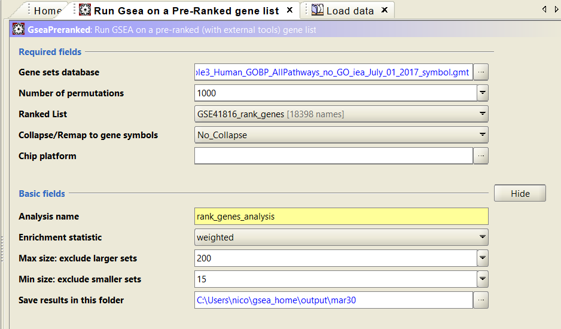
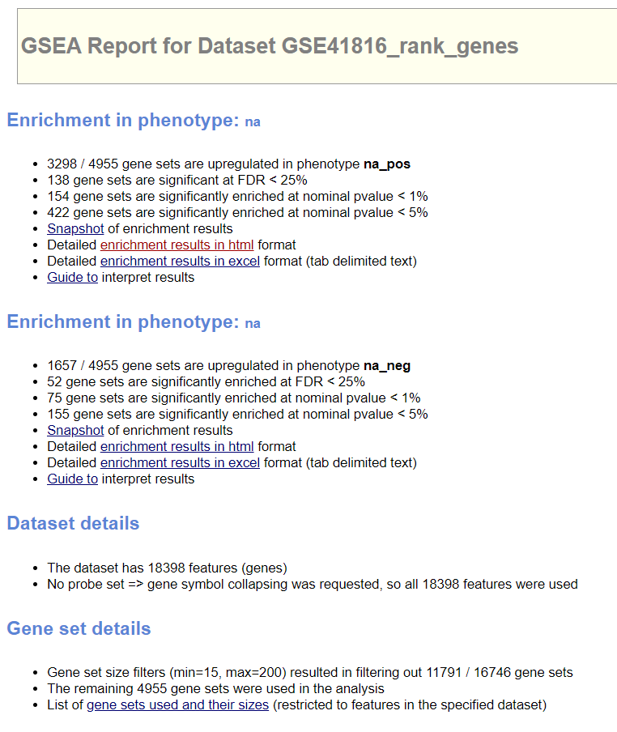
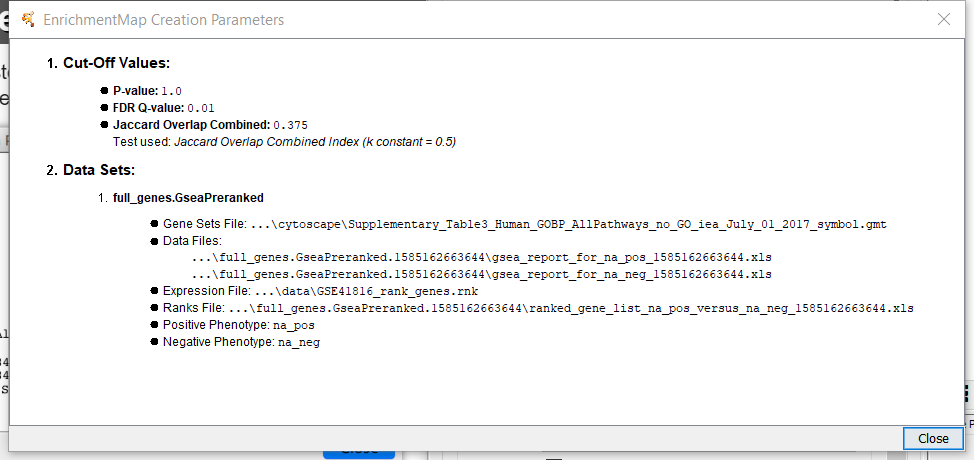
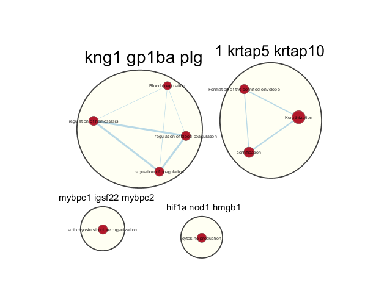
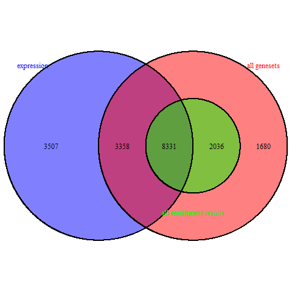
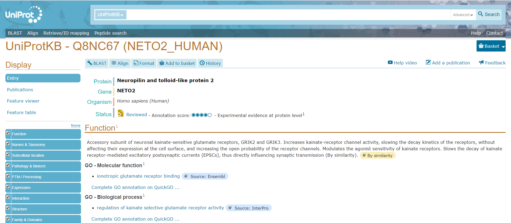

## Introduction
  This dataset is the gene expression profiling of MDA231, BT549 and SUM159PT celles after selumetinib treatment or DUSP4 siRNA knockdown. MDA231, BT549 and SUM159PT basal-like breast cancer cell lines were transfected with non-targeting siRNA (siCONTROL), siRNA targeting DUSP4 (siDUSP4), or siCONTROL + 4 or 24 hr of 1uM selumetinib. The data were log2 RMA normalized.   
  
  Select the above dataset, cleaned and normalized the gene counts and mapped the gene names to HUGO symbols. Then perfoem differential gene expression analysis. From the previous analysis, we got the ranked gene list and g:Profiler results.  
  
  
## Summary

### GSEA Analysis
```{r, echo=FALSE}
# Dark Matter
library(GSA)
gmt_file <- file.path("data",
                      "Human_GOBP_AllPathways_no_GO_iea_July_01_2017_symbol.gmt")

capture.output(genesets <- 
                 GSA.read.gmt(gmt_file), file="gsa_load.out")

names(genesets$genesets) <-genesets$geneset.names

expression <- read.table(file.path("data",
                                   "Supplementary_Table6_TCGA_OV_RNAseq_expression.txt"),
                         header = TRUE, sep = "\t",
                         quote = "\"", stringsAsFactors = FALSE)

ranks <- read.table(file.path("data",
                              "GSE41816_rank_genes.rnk"),
                    header = TRUE, sep = "\t", quote="\"", stringsAsFactors = FALSE)
```

  Download all human GO biological process from Bader's lab. Then we can use the GSEA to have gene analysis. Import the previous ranked_gene.rnk, Human_GOBP.gmt into the GSEA.   

```{r, echo=FALSE}
#get all the GSEA directories
gsea_directories <- list.files(path = file.path("data"),
                               pattern = "\\.GseaPreranked")

if(length(gsea_directories) == 1){
  gsea_dir <- file.path("data", gsea_directories[1])
  #get the gsea result files
  gsea_results_files <- list.files(path = gsea_dir,
                                   pattern = "gsea_report_*.*.xls")
  #there should be 2 gsea results files
  enr_file1 <- read.table(file.path(gsea_dir, gsea_results_files[1]),
                          header = TRUE, sep = "\t", quote = "\"", stringsAsFactors = FALSE, row.names = 1)
  
  enr_file2 <- read.table(file.path(gsea_dir, gsea_results_files[1]),
                          header = TRUE, sep = "\t", quote = "\"", stringsAsFactors = FALSE, row.names = 1)
}
```

  We have the following parameters to do the pre-ranked gene list.  



  
  The following shows the overall results of the GSEA pre-ranked.    
  



  POS top term:  
  1. REGULATION OF BLOOD COAGULATION%GOBP%GO:0030193  
  2. size: 71; ES: 0.83; NES: 1.96; NOM p-val: 0.000; FDR q-val: 0.000; FWER p-val: 0.000;  
    
  NEG top term:  
  1. OXIDATIVE STRESS INDUCED SENESCENCE%REACTOME%R-HSA-2559580.3  
  2. size: 105; ES: -0.72; NES:-1.95; NOM p-val: 0.000; FDR q-val: 0.014; FWER p-val: 0.015;  

#### Cytoscape EnrichmentMap
  Import GSEA resulting files into the Cytoscape. The we can build the enrichment map.  
  The enrichement map parameters are showing as following picture.  



  The results EnrichmentMap has 9 nodes and 9 edges.



  Only got a few genes from the Cytoscape. Then, need to see the dark matters from the gene list. Get the genes from the set of enriched pathways from GSEA results and get all the unique genes, reduce the duplicates.   

```{r, echo=FALSE}
#get the genes from the set of enriched pathways
all_enr_genesets <- c(rownames(enr_file1), rownames(enr_file2))

genes_enr_gs <- c()
for(i  in 1:length(all_enr_genesets)){
  current_geneset <- unlist(genesets$genesets[which(genesets$geneset.names %in% all_enr_genesets[i])])
  genes_enr_gs <-union(genes_enr_gs, current_geneset)
}
```
  
  Set the FDR threshold as 0.01, then filter the genes which less than the threshold.  
  
  
```{r, echo=FALSE}
FDR_threshold <- 0.01
#get the genes from the enriched pathways
all_sig_enr_genesets <- c(rownames(enr_file1)[which(enr_file1[, "FDR.q.val"] <= FDR_threshold)],
                          rownames(enr_file2)[which(enr_file2[,"FDR.q.val"] <= FDR_threshold)])

genes_sig_enr_gs <- c()

for(i in 1:length(all_sig_enr_genesets)){
  current_geneset <- unlist(genesets$genesets[which(genesets$geneset.names %in% all_sig_enr_genesets[i])])
  genes_sig_enr_gs <- union(genes_sig_enr_gs, current_geneset)
}

genes_all_gs <- unique(unlist(genesets$genesets))
```

  Then, we have the following results:  
  
```{r, echo=FALSE}
print("All genes in the expression set")
length(rownames(expression))

print("All genes in the enrichment results")
length(genes_enr_gs)

print("All genes in the significant enrichment results")
length(genes_sig_enr_gs)

print("All genes in geneset file")
length(genes_all_gs)
```


```{r, echo=FALSE}
library(VennDiagram)
A <- genes_all_gs
B <- genes_enr_gs
C <- expression[,1]
png(file.path("data", "dark_matter_overlaps.png"))
draw.triple.venn(area1 = length(A), 
                 area2 = length(B), 
                 area3 = length(C), 
                 n12 = length(intersect(A,B)),
                 n13 = length(intersect(A,C)),
                 n23 = length(intersect(B,C)),
                 n123 = length(intersect(A, intersect(B,C))),
                 category = c("all genesets", "all enrichment results", "expression"),
                 fill = c("red", "green", "blue"),
                 cat.col = c("red", "green", "blue")
)
```
  
  The following picture shows the overlapping number of genes. 
  


  
  The following table shows the top ranked genes without annotations that comparing all the genes in geneset file with all the genes in expression set.  

```{r, echo=FALSE}
#get the set of genes that have no annotation
genes_no_annotation <- setdiff(expression[,1], genes_all_gs)

#get the top ranked genes that have no annotation
ranked_gene_no_annotation <- ranks[which(ranks[,1] %in% genes_no_annotation),]

head(ranked_gene_no_annotation)
```

  This is the resulting gene reference from UniProt.  



### Interpretation and detailed view of results
  From the above information, we can see that there are some ranked genes without any anotations. Those dark matters are important in the post analysis. 
  
  This heatmap returns the significant genes that are not annotated ot any pathways in entire set of pathways.  

```{r, echo=FALSE}
# entire set of gene lists
library(pheatmap)
load("genes.Rdata")
load("exp_GSE41816_id_trans.Rdata")
h <- qlf_hits[which(ranked_gene_no_annotation$ANPEP %in% qlf_hits$x), ]
c_m <- exp1[h$x, 2:37]
pheatmap::pheatmap(c_m,
                   border_color = NA,
                   show_rownames = FALSE,
                   drop_levels = TRUE)
```

  The following table shows the top ranked genes without annotation that comparing all genes in the enrichment map analysis with all genes in expression set.  
  
```{r, echo=FALSE}
# genes analysis in enrichment map
enr_wo_annotation <- setdiff(expression[,1], genes_enr_gs)

ranked_enr_wo_annotation <- ranks[which(ranks[,1] %in% enr_wo_annotation),]

head(ranked_enr_wo_annotation)
```

  The heatmap shows any significant genes that are not anootated to any of the pathways returned in the enrichment analysis.  
  
```{r, echo=FALSE}
k <- qlf_hits[which(ranked_enr_wo_annotation$ANPEP %in% qlf_hits$x), ]
ck <- exp1[k$x, 2:37]
pheatmap::pheatmap(ck,
                   border_color = NA,
                   show_rownames = FALSE,
                   drop_levels = TRUE)
```

## Reference
1. Hanbo Chen (2018). VennDiagram: Generate
  High-Resolution Venn and Euler Plots. R
  package version 1.6.20.
  https://CRAN.R-project.org/package=VennDiagram
  
2. Brad Efron and R. Tibshirani (2019). GSA:
  Gene Set Analysis. R package version
  1.03.1.
  https://CRAN.R-project.org/package=GSA

3. Ono K, Muetze T, Kolishovski G, Shannon P,
  Demchak, B. CyREST: Turbocharging
  Cytoscape Access for External Tools via a
  RESTful API [version 1; referees: 2
  approved]. F1000Research 2015, 4:478.
  
4. D. Merico, R. Isserlin, O. Stueker, A. Emili, and G. D. Bader, "Enrichment Map: A Network-Based Method for Gene-Set Enrichment Visualization and Interpretation," PLoS ONE, vol. 5, no. 11, p. e13984, Nov. 2010, doi: 10.1371/journal.pone.0013984.

5. J. Reimand et al., "Pathway enrichment analysis and visualization of omics data using g:Profiler, GSEA, Cytoscape and EnrichmentMap," Nat Protoc, vol. 14, no. 2, pp. 482-517, Feb. 2019, doi: 10.1038/s41596-018-0103-9.

6. A. Subramanian et al., "Gene set enrichment analysis: A knowledge-based approach for interpreting genome-wide expression profiles," Proceedings of the National Academy of Sciences, vol. 102, no. 43, pp. 15545-15550, Oct. 2005, doi: 10.1073/pnas.0506580102.

7. UniProt ConsortiumEuropean Bioinformatics InstituteProtein Information ResourceSIB Swiss Institute of Bioinformatics. (2020, February 26). Neuropilin and tolloid-like protein 2. Retrieved from https://www.uniprot.org/uniprot/Q8NC67

8. Balko, J. M., Schwarz, L. J., Bhola, N. E., Kurupi, R., Owens, P., Miller, T. W., . Arteaga, C. L. (2013, October 15). Activation of MAPK pathways due to DUSP4 loss promotes cancer stem cell-like phenotypes in basal-like breast cancer. Retrieved from https://www.ncbi.nlm.nih.gov/pubmed/23966295  

9. Raivo Kolde (2019). pheatmap:
  Pretty Heatmaps. R package version
  1.0.12.
  https://CRAN.R-project.org/package=pheatmap
  
```{r, echo=FALSE, include=FALSE}
citation(package = "VennDiagram")
citation(package = "GSA")
citation(package = "RCy3")
citation(package = "pheatmap")
```

